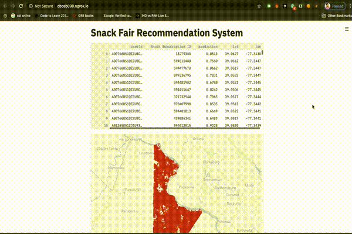
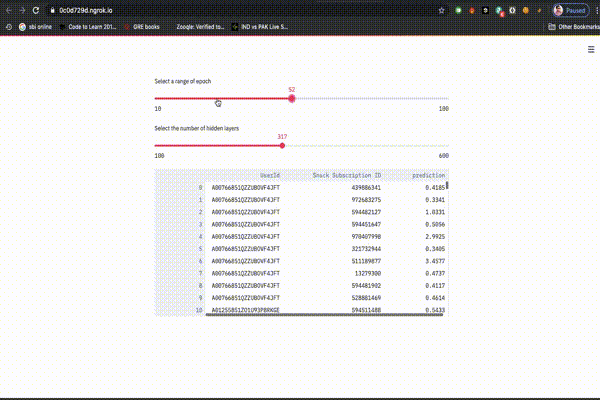

# Snackfair-Recommendation-System

Use [google colab](https://colab.research.google.com/notebooks/intro.ipynb) to run this code.

[Video Presentation](https://youtu.be/le2oF0i1MBA)

# Recommendation System Web Integration - Streamlit

[Streamlit](https://www.streamlit.io/) is an open-source app framework for Machine Learning and Data Science teams.

Once the data is prepared and the RBM model is implemented, the final trained dataset is obtained. This dataset is then used to integrate the recommendation system to the web based application.

## Steps to run ngrok cloud by generating a public URL.
* Install the streamlit on Google Colab.</br>
``!pip install streamlit``
* Upload the [Integration.py](https://github.com/rxchoudhury/RBM-Recommendation-System/blob/master/My_RBM_Project/Integration.py) file.

* Run the following code to Install ngrok.
```
### Install ngrok
!wget https://bin.equinox.io/c/4VmDzA7iaHb/ngrok-stable-linux-amd64.zip
!unzip ngrok-stable-linux-amd64.zip
```
* Run the following code to get the public url to run the application(Do not click or use the URL until the last step of code is run):
```
get_ipython().system_raw('./ngrok http 8501 &')

! curl -s http://localhost:4040/api/tunnels | python3 -c \
    "import sys, json; print(json.load(sys.stdin)['tunnels'][0]['public_url'])"
```
* Finally run the streamlit app using the following code:
```
!streamlit run Integration.py
```
## Streamlit User Interface







# Test Dataset

The dataset has information that will be used by the recommender system to get the desired outcomes. The dataset used is a modified version of the dataset given below:

[Dataset Link](https://www.kaggle.com/saurav9786/recommender-system-using-amazon-reviews)

The following is the description of the test dataset:

* userId : Every user identified with a unique id (First Column)
* productId : Every product identified with a unique id(Second Column)
* Rating : Rating of the corresponding product by the corresponding user(Third Column)
* timestamp : Time of the rating ( Fourth Column)


# Restricted Boltzmann Machine

A [Restricted Boltzmann](https://www.cs.toronto.edu/~rsalakhu/papers/rbmcf.pdf) Machine (RBM) is a generative neural network model typically used to perform unsupervised learning. The main task of an RBM is to learn the joint probability distribution P(v, h), where v are the visible units and h the hidden ones.

Here the RBM model is used for Collaborative Filtering which is used by e-commerce websites like Amazon to recommend products to new customers.

Following steps are taken to implement RBM:

1. Loading Data
2. Splitting the data using the stratified splitter
3. Training the RBM model
4. Using evaluation metrics to measure performance

# Data Preparation

The initial dataset had 4 Columns and 1 Million Rows.

Various modifications have been done on the dataset to get the final dataset which has 10 Columns and 10485 Rows.

Our dataset has 16 different snack subscription services and is randomly distributed. Each service has a particular set price and other nutritional and energy information.

Our final dataset has the following columns:

* UserId
* Rating
* Timestamp
* Snack_Sub_Name: Brand of the subscription service
* Price
* Snack Subscription ID: Unique ID given to the subscription services
* Calories kcal: Energy content in the subscription service in kilocalories
* Protein g
* Fat g
* Serving Size g
